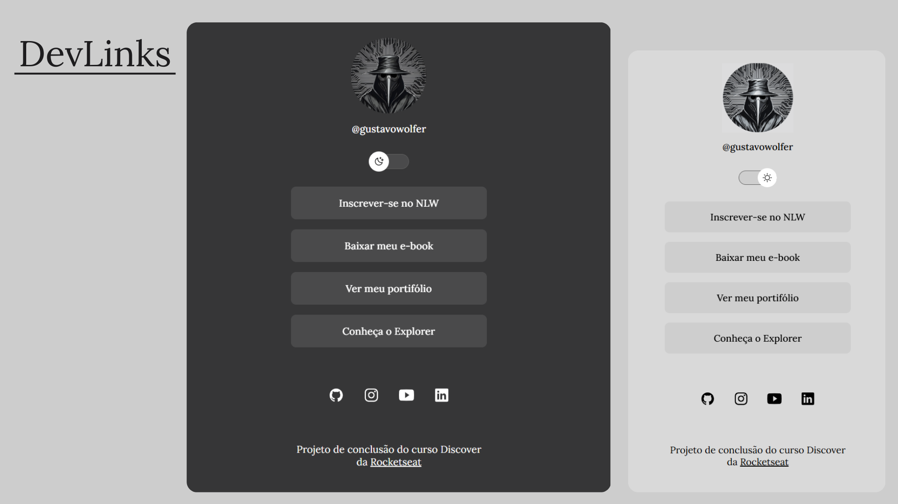

<h1 align="center"> DevLinks </h1>

TCC Discover da Rocketseat  

  <a href="#-tecnologias">Tecnologias</a>&nbsp;&nbsp;&nbsp;|&nbsp;&nbsp;&nbsp;
  <a href="#-projeto">Projeto</a>&nbsp;&nbsp;&nbsp;|&nbsp;&nbsp;&nbsp;
  <a href="#-layout">Layout</a>&nbsp;&nbsp;&nbsp;&nbsp;&nbsp;&nbsp;
  

 

  

## 🚀 Tecnologias

Esse projeto foi desenvolvido com as seguintes tecnologias:

- HTML e CSS
- JavaScript
- Git e Github
- Figma (I used the downloaded assets folder.)
- Canva
- Ferramenta de captura do windows

## 💻 Projeto

O DevLinks é um agregador de links para usar como cartão de visitas online, caso ao clicar em um link e o mesmo não funcione é pq eu não possuo o conteudo dele, como exemplo ter canal no youtube.

- <a href="https://gustavowolfer.github.io/DevLinks/" target="_blank">Acesse o projeto, online</a>

- <a href="https://maykbrito.github.io/devlinks" target="_blank">Acesse o projeto original, online</a>

## 🔖 Layout

Você pode visualizar o layout do projeto original através <a href="https://www.figma.com/community/file/1187422022288947321" target="_blank">DESSE LINK</a>. É necessário ter conta no <a href="https://figma.com" target="_blank">Figma</a> para acessá-lo.

---

<a href="https://discord.gg/rocketseat" target="_blank">Participe da comunidade Rocketseat!</a>
